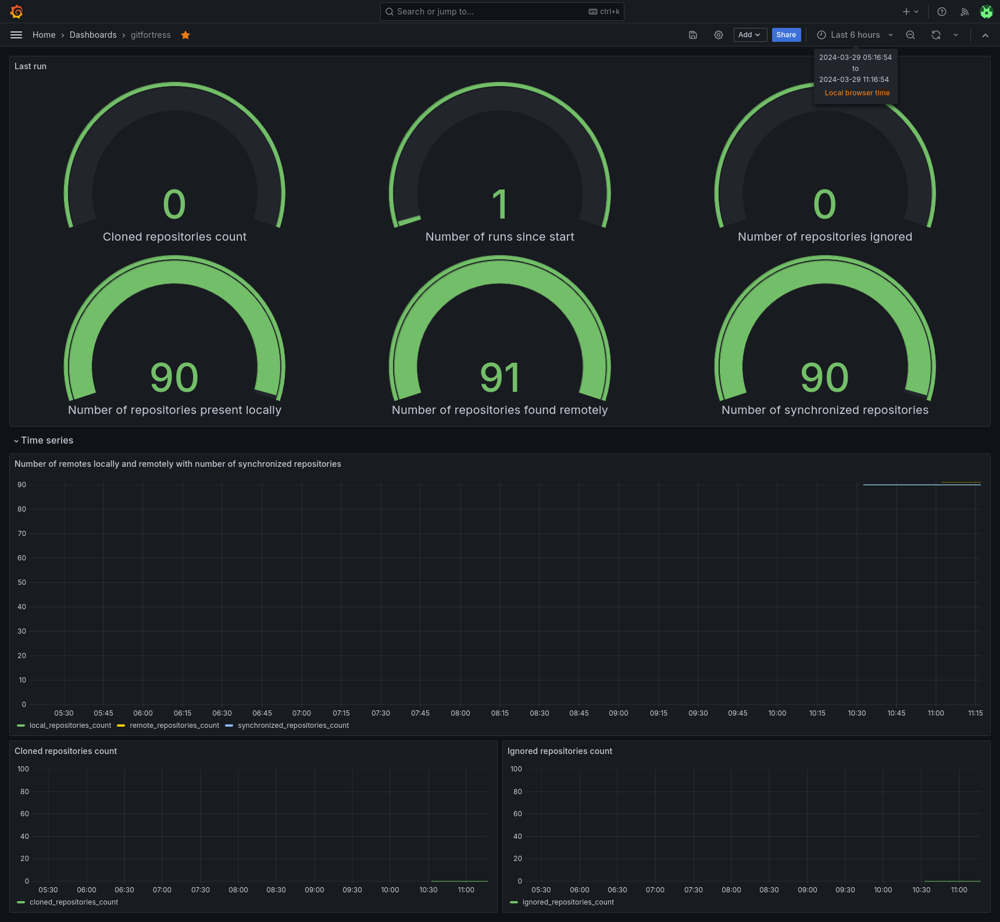

# GitFortress

GitFortress is a powerful tool designed to synchronize your GitHub repositories in a remote location securely and efficiently. This tool ensures your repositories are always backed up and kept in sync with their remote state, offering peace of mind and data security for developers and teams alike.

## Features
- **Automatic Synchronization**: Clone all repos available to the user and continuously keep them in sync with the remote state.
- **Flexibility**: Runs as a standalone binary or within a Docker container for ease of deployment and use.
- **Configuration Freedom**: Customizable through a simple configuration file, allowing users to specify their backup preferences.
- **Keeps track**: Publishes metrics to prometheus and/or influxdb 

## Installation Instructions

### Docker
Pull the GitFortress image using the following command:
```
docker pull muscaw/gitfortress:latest
```

## Configuration

### Config File
Create a `config.yml` file with the following structure:
```
github_token: "Your Github PAT token"
sync_delay: "5m" # Uses Golang's units. Valid time units are "ns", "us", "ms", "s", "m", "h"
clone_folder_path: "path/to/clone/folder"
ignore_repositories_regex: []
influx_db: # Optional
  url: "influx-url"
  token: "influx-token"
  org_name: "influx-org-name"
  bucket_name: "influx-bucket-name"
prometheus:
  exposed_port: 1000 # exposed port for prometheus consumption
  auto_convert_names: false # whether to automatically add a marker for counter type metrics such as _total
```

GitFortress reads the following paths in the given order. If it finds a valid config file, it will use it and not search for the next config files.
- $HOME/.config/gitfortress/config.yml
- /etc/gitfortress/config.yml

All the fields of the config file can be passed through environment variables with the following pattern:
`GITFORTRESS_field_name`

Example:
```
GITFORTRESS_GITHUB_TOKEN
GITFORTRESS_CLONE_FOLDER_PATH
```

Environment variables that refer to lists can be passed using commas to delimit the items: 
```
GITFORTRESS_IGNORE_REPOSITORIES_REGEX=^first-regex$,^second-regex$
```

#### Fields Explanation

See [examples/config.yml](examples/config.yml)


### Generating a GitHub PAT
1. Go to GitHub Settings.
2. Navigate to Developer settings > Personal access tokens > Generate new token.
3. Select `repo` to grant full control of private repositories.
4. Click on the `Generate token` button.
5. Copy the generated token to your `config.yml` as the `github_token` value.

### Usage Instructions

#### Binary
Run GitFortress by executing:
```
./gitfortress
```

#### Docker
To run GitFortress using Docker, use the following command:
```
docker run --rm -v /path/to/config/directory:/etc/gitfortress ghcr.io/Muscaw/GitFortress:latest
```
Replace `/path/to/config/directory` with the actual path to your configuration directory.

#### Docker Compose
For Docker Compose, include the following in your `docker-compose.yml` file:
```yaml
services:
  gitfortress:
    image: muscaw/gitfortress:latest
    volumes:
      - /path/to/config/directory:/etc/gitfortress
      - /path/to/clone/directory:/backup
```
Replace the placeholders with the actual path to your configuration directory.


## Metrics

Both Prometheus and InfluxDB backends are supported and can be configured to publish execution metrics (see [config.yml](examples/config.yml)).

A sample dashboard for Grafana is available in the [examples folder](examples/grafana_influx_dashboard.json).



## Contributing
We welcome contributions! Please refer to our [CONTRIBUTING.md](CONTRIBUTING.md) for guidelines on how to make GitFortress better.

## License
GitFortress is released under the MIT License.

## Contact Information
For support or inquiries, please open an issue on the GitHub repository.
